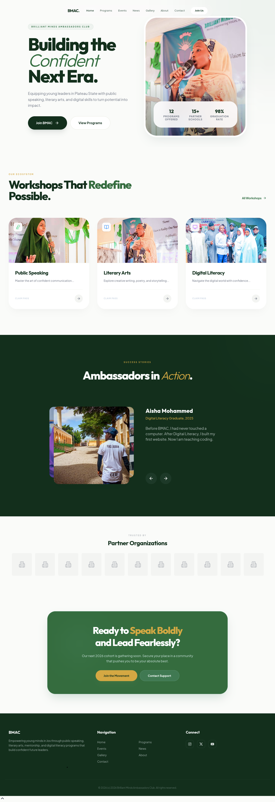
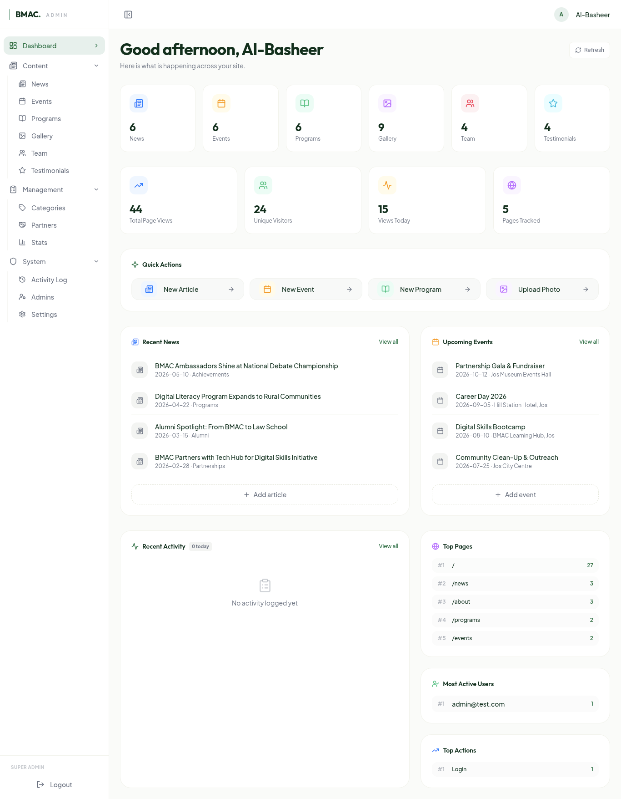

# BMAC Next

A full-stack web platform for Brilliant Minds Ambassadors Club (BMAC) Jos, a youth empowerment NGO in Plateau State, Nigeria. I built this to give the team a CMS they can use and members a site that works on their phones.



## What it does

The public site lets visitors browse programs (Public Speaking, Digital Literacy, Mentorship, Debate, Creative Writing, Literary Arts), read news, register for events, view a photo gallery, and get involved as a member, volunteer, school chapter, donor, or partner. Event registration handles both free and paid events through Paystack. The contact form sends emails via Resend, and there's a newsletter signup modal.

The admin dashboard is a full CMS where logged-in admins manage all site content: news, events, programs, gallery, team members, testimonials, partners, and impact stats. The dashboard shows live stats (total views, unique visitors, today's activity), recent content, and top pages. Admins can invite other admins with role-based permissions (super_admin, administrator, moderator), and every action gets logged in an activity feed.



## Screenshots

**Programs**


**Program detail**


**Events**


**News**


**Get involved**


**Gallery**


**About**


## Tech stack

- **Framework:** Next.js 16 (App Router) with React 19
- **Styling:** Tailwind CSS v4
- **Database:** Neon Postgres (HTTP driver, no ORM)
- **Auth:** Custom HMAC-signed cookie sessions
- **Payments:** Paystack (inline.js)
- **Email:** Resend (contact forms)
- **Rich text:** TipTap editor (news articles, events)
- **Charts:** Chart.js (admin analytics)
- **Hosting:** Vercel

## Why I built it

BMAC runs programs across schools in Jos and needed a single place to manage events, let the team update content, and handle membership and donations. Before this, content was scattered across different places and admin work required a developer. I wanted to build something the team could actually use without calling me every time they needed to change a paragraph.

Built as a [Horizons](https://horizons.dev) project.

## How I built it

I used coding agents (Claude Code, Cursor) to help scaffold components, boilerplate, and repetitive features like CRUD forms, table views, and API routes. The agents handled a lot of the tedious wiring, which let me focus on the frontend code and styling.

I spent most of my time on the frontend: building out the public pages, tweaking layouts, getting the admin dashboard to look right, and making sure things work on mobile. Tailwind CSS v4 with CSS variables made it easier to keep a consistent look across the site. Framer Motion handles the animations, Embla Carousel does the carousels, and I used TipTap for the rich text editor in the CMS.

The data layer is a thin abstraction over Neon's HTTP driver (`src/lib/db.ts`). No ORM. I built a `db` object that exposes `getAll`, `getById`, `create`, `update`, `remove`, `exists`, `count`, and `query` functions that build parameterized SQL and auto-serialize objects/arrays to JSONB. Every admin CRUD operation goes through `src/actions/crud.ts`, which handles auth checks, database calls, and activity logging in one pass.

The auth system uses HMAC-signed cookies instead of JWTs. On login, an external auth service verifies credentials and I sign a session cookie with a server-side secret. Admin middleware (`src/proxy.ts`) intercepts every `/admin/*` request, reads the cookie, and rejects unauthenticated access. Permission checks happen at both the layout level (nav items hidden based on role) and the action level (`requirePermission()` in server actions).

Page views are tracked client-side. I added a `TrackView` component in the root layout that fires a POST to `/api/track` on every public page navigation, storing the path, referrer, user agent, and a session ID in the `page_views` table. The admin dashboard reads from this table to show visitor counts, top pages, and a 30-day view chart.

## Development

1. Clone the repository

```sh
git clone <repo-url>
cd bmac-next
```

2. Install dependencies

```sh
npm install
```

3. Set up environment variables

```sh
cp .env.example .env.local
```

Fill in the keys. You'll need accounts for Neon, Paystack, and Resend. See `SETUP.md` for detailed instructions on where to get each one.

| Variable | Purpose |
|---|---|
| `NEON_DB_URL` | Postgres connection string |
| `SUPER_ADMIN_EMAIL` | First admin email |
| `SUPER_ADMIN_PASSWORD_HASH` | Generate with `node scripts/generate-password-hash.mjs <password>` |
| `SUPER_ADMIN_COOKIE_SECRET` | Generate with `openssl rand -hex 32` |
| `NEXT_PUBLIC_PAYSTACK_PUBLIC_KEY` | Paystack public key |
| `PAYSTACK_SECRET_KEY` | Paystack secret key |
| `RESEND_API_KEY` | Resend API key |
| `NEXT_PUBLIC_APP_URL` | `http://localhost:3000` for local dev |

4. Seed the database

```sh
psql $NEON_DB_URL -f scripts/seed.sql
```

5. Start the dev server

```sh
npm run dev
```

Public site at `http://localhost:3000`, admin dashboard at `http://localhost:3000/admin`.

### Other commands

```sh
npm run build        # Production build
npm test             # Run tests (Vitest)
npm run lint         # ESLint
npx tsc --noEmit     # Type check
```

## AI disclosure

I used coding agents (Claude Code, Cursor) to scaffold CRUD forms, admin table views, API routes, and other boilerplate. The agents wrote a lot of the repetitive admin components and database helper functions while I focused on the frontend code and styling, and made the architectural decisions: choosing a raw SQL layer over an ORM, building custom HMAC cookie auth instead of using Clerk, and designing the activity logging system. I reviewed and modified everything the agents produced.
