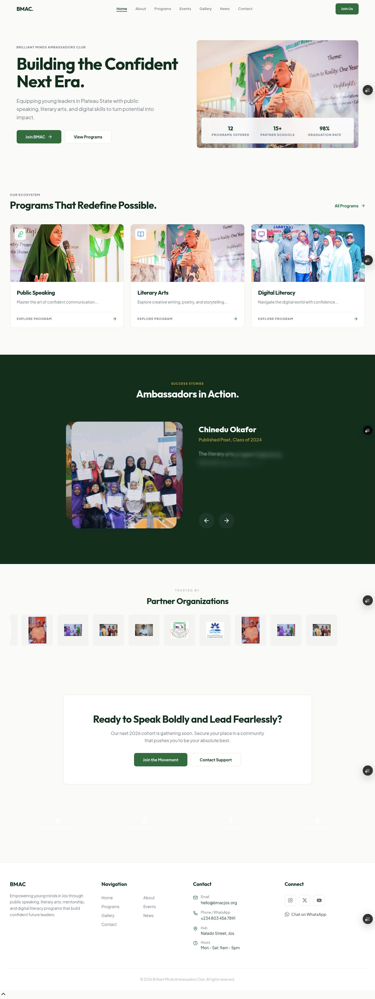
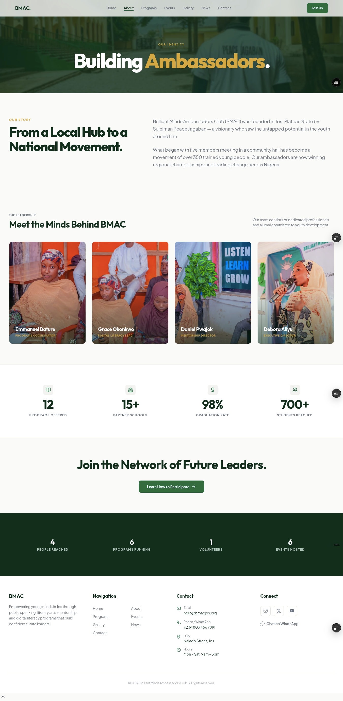
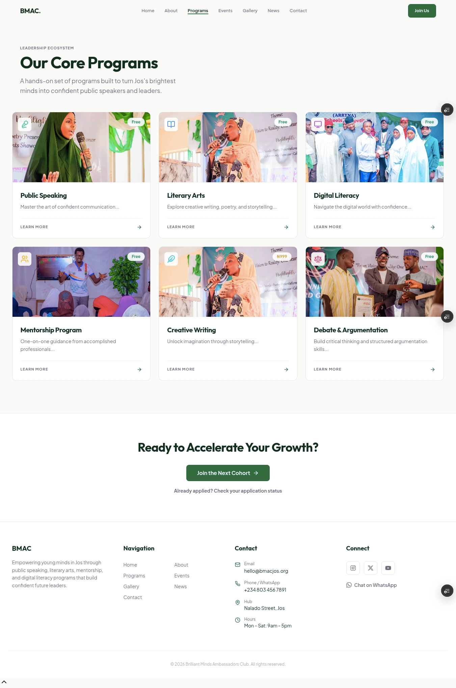
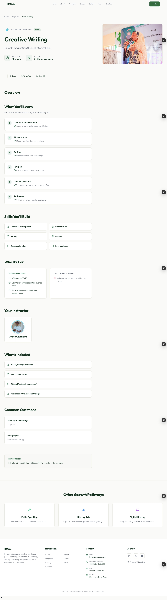

# BMAC Next

Hey! This is a website I built for Brilliant Minds Ambassadors Club (BMAC) Jos, a youth empowerment NGO here in Plateau State, Nigeria.



## What it does

On the public side, people can browse BMAC's programs, read news, register for events (free or paid, Paystack handles the payment part), scroll the photo gallery, and sign up as a member, volunteer, donor, or partner.

On the admin side, the team gets a dashboard where they can manage all of that themselves: news, events, programs, gallery, whatever. There's also traffic stats and an activity log so you can see who changed what.

**Screenshots:**
### About page


## Programs page


## Programs detail page


## Tech stack

- Next.js 16 (App Router), React 19
- Tailwind CSS v4
- Neon Postgres, no ORM, just raw SQL through a small `db` helper I wrote
- Custom HMAC-signed cookie sessions for auth, backed by an Express auth service (`bmac-express-server`)
- Paystack for payments; Nodemailer SMTP via the Express backend for admin email, Resend for the public contact form
- TipTap for the CMS editor, Chart.js for the admin analytics
- Deployed on Vercel

## Why I built it

BMAC runs programs in schools all over Jos, and before this, everything (event details, news, member info) lived scattered across docs and group chats. I wanted the team to be able to run this themselves without messaging me every time a paragraph needed editing.

## How it was made

I leaned on the Opencode coding agent for the boring parts like CRUD forms, table views and API routes. That gave me more time to actually sit with the frontend, the stuff that needed a human eye like layout, making it work on phones, and getting the admin dashboard to not feel clunky.

Built as a [Horizons](https://horizons.dev) project.

## Development

If you want to run it yourself? Here's how.

1. Clone the repo
```sh
git clone <repo-url>
cd bmac-next
```
2. Install dependencies
```sh
npm install
```
3. Set up the Express auth backend first (it owns admin auth + admin email). See [SETUP.md](SETUP.md).
4. Set up environment variables
```sh
cp .env.example .env.local
```
Fill in the values below (see `SETUP.md` for where to get each one):

| Variable | Purpose |
|---|---|
| `NEON_DB_URL` | Postgres connection string |
| `SUPER_ADMIN_COOKIE_SECRET` | Generate with `openssl rand -hex 32` |
| `EMAIL_SERVICE_URL` | Express backend URL (`http://localhost:3001` locally) |
| `EMAIL_SERVICE_API_KEY` | Shared key, must match the backend's `EMAIL_SERVICE_API_KEY` |
| `NEXT_PUBLIC_PAYSTACK_PUBLIC_KEY` | Paystack public key |
| `PAYSTACK_SECRET_KEY` | Paystack secret key |
| `RESEND_API_KEY` | Resend API key (contact form only) |
| `NEXT_PUBLIC_APP_URL` | `http://localhost:3000` for local dev |

5. Seed the database
```sh
psql $NEON_DB_URL -f scripts/seed.sql
```
6. Start the dev server
```sh
npm run dev
```
Public site at `localhost:3000`, admin at `localhost:3000/admin`. First admin is registered at `localhost:3000/admin/setup`.

Other commands: `npm run build`, `npm test`, `npm run lint`, `npx tsc --noEmit`.

## AI disclosure

I used the Opencode agent to scaffold repetitive admin stuff (CRUD forms, table views) and database helper functions. I wrote and styled the frontend myself, and made the actual architecture calls like custom cookie auth instead of Clerk, and the activity logging system. Everything the agent produced, I read through and edited by hand before it went in.